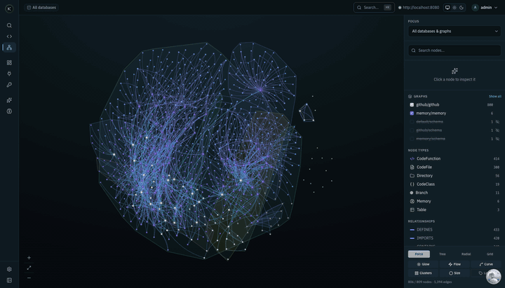
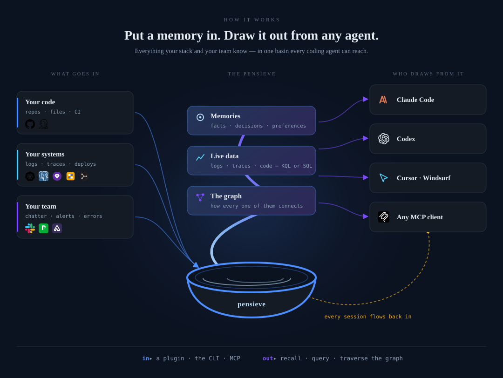

<p align="center">
  <a href="https://shakedaskayo.github.io/pensieve/">
    
  </a>
</p>

<h1 align="center">pensieve</h1>

<p align="center"><strong>The context engine for coding agents.</strong></p>

<p align="center">
  Your coding agent forgets everything when the session ends — and even mid-session it
  can't see your logs, your traces, or how today's decision relates to the service it's
  about. <strong>pensieve is the one place it gets all three: durable memory, live data
  (logs, traces, code — queried in KQL/SQL), and the graph that links them</strong> —
  over a real columnar engine, not a key-value store.<br/>
  Wire it in with a <strong>Claude Code plugin</strong>, a <strong>CLI</strong>, or
  <strong>MCP</strong>. One <strong>local binary</strong>, zero infra; syncs to your control plane.
</p>

<p align="center">
  <a href="https://shakedaskayo.github.io/pensieve/"></a>
  <a href="https://shakedaskayo.github.io/pensieve/agent/memory"></a>
  <a href="LICENSE"></a>
  
  
</p>

<p align="center">
  <a href="#quickstart-local-zero-infra">Quickstart</a> ·
  <a href="#what-your-agent-gets">Tools</a> ·
  <a href="#the-numbers">Numbers</a> ·
  <a href="#why-pensieve">Why pensieve</a> ·
  <a href="#how-it-works">How it works</a> ·
  <a href="#two-tiers-local-binary--control-plane">Tiers</a>
</p>

---

<p align="center">
  
</p>
<p align="center"><em>Your services, infra, repos, people — and your agent's memories — as one living, typed knowledge graph.</em></p>

---

> **A memory store remembers what you told it. A context engine also knows your live
> systems and how everything connects.**



Most memory tools give your agent *facts*. pensieve gives it the facts, the **live logs,
traces, and code those facts are about**, and the **graph** that ties a decision to the
service it concerns — one query surface, one MCP server. Recall *plus* live context
*plus* relationships, however your agent connects.

It runs as a **single local binary** — embedded catalog + local files, no Postgres, no
Docker, no sudo — wires into your agent in one command, and **syncs to a hosted control
plane** so memory stays coherent across your machines and team. The Claude Code plugin
goes further: it captures each session and injects the right memories into **every
prompt automatically** — not just when the agent makes a tool call.


---

## Quickstart (local, zero infra)

**One command.** Installs the `pensieve` binary, then a wizard starts the local server,
connects the CLI, and wires your coding agent. Embedded SQLite + local files, installed
to `~/.local/bin` — no Postgres, no Docker, no sudo:

```bash
curl -fsSL https://raw.githubusercontent.com/shakedaskayo/pensieve/main/install.sh | bash
```

You're now running. The wizard leaves you with:

- **Web UI + API** → **http://localhost:7777** (Graph Explorer · Memory · KQL/SQL workbench) — your first visit creates the admin user
- the server runs as a **background service** (starts at login, restarts on crash) — `pensieve service status`
- **Claude Code plugin** installed → restart Claude Code, run **`/pensieve-status`**
- the **`pensieve` CLI** on your `$PATH`

**Try it** — a memory round-trips through the same engine the UI and your agent use:

```bash
pensieve remember "payments-svc deploys behind the Aurora gateway; error budget is 0.1%."
pensieve recall   "how do we deploy payments and what's the error budget?"
# → returns the memory, scored by vector + keyword + graph
```

> **Windows**: install inside [WSL2](https://learn.microsoft.com/windows/wsl/install) — the same one-liner works in the WSL shell. Native Windows support is tracked but not there yet.
>
> **Uninstall**: `curl -fsSL https://raw.githubusercontent.com/shakedaskayo/pensieve/main/install.sh | bash -s -- --uninstall` (add `--purge` to also delete `~/.pensieve`).

**Wire any agent over MCP** (zero server, zero auth — stdio):

```bash
pensieve setup claude-code      # or: cursor · windsurf — writes the agent's MCP config to launch `pensieve mcp`
```

Restart the agent and it has the full toolset (memory + data + graph).

<details>
<summary>Scripted / CI · build from source · staying current</summary>

```bash
# Scripted (skip the prompts):
curl -fsSL …/install.sh | bash -s -- --yes                    # binary only
curl -fsSL …/install.sh | bash -s -- --yes --serve --plugin   # + server + Claude Code plugin

# From source (Rust toolchain + pnpm; the CLI embeds the web UI, so build it first):
git clone https://github.com/shakedaskayo/pensieve && cd pensieve
pnpm -C web build && cargo install --path crates/pensieve-cli   # installs `pensieve-cli`; symlink to `pensieve` if you like

# Stay current (the web UI ships inside the binary — updating one updates both):
pensieve update          # grab the latest release + restart on the new UI
pensieve update --check  # just tell me if I'm behind
```

`pensieve version` / `pensieve serve` also nudge once a day when a newer release exists
(`PENSIEVE_NO_UPDATE_CHECK=1` to opt out).

</details>

Want it server-side for a team, with data sources and continuous ingestion? See
**[Two tiers](#two-tiers-local-binary--control-plane)**.

---

## What your agent gets

The whole context engine — not just recall — reachable however your agent connects.
Plugin slash commands, the CLI, or MCP tools all hit the same engine:

| | Tools | What it does |
|---|---|---|
| 🧠 **Memory** | `memory_search` · `recall_memory` · `save_memory` · `list_memories` | Graph-aware hybrid recall (vector + keyword + graph), durable across sessions/machines. |
| 🕸️ **Graph** | `ingest_entity` · `link_memory_to_entity` · `graph_traverse` · `find_references_to` | Mint **virtual resources**, wire them to memories *and* real resources, walk the graph. |
| 📊 **Live data** | `run_kql` · `run_sql` · `explore_schema` · `describe_table` · `sample_rows` · `list_databases` | Query logs, traces, data-source tables, the catalog — in KQL or SQL, sub-second. |
| 🛠️ **Curation** | `update_memory_status` · `update_memory_importance` · `memory_compare` · `memory_judge` · `memory_session_summary` | Re-weight, archive, resolve conflicts, record session recaps. |

> Call `memory_search` **first** when a question may depend on prior context, then follow
> the `linked` resources with `graph_traverse` for a deeper subgraph — so answers are
> grounded in what you've actually decided *and* how your systems actually look.

**Three ways to connect, same engine underneath:**

- **Claude Code plugin** (`pensieve install-plugin`) — *automatic*. Hooks inject the most
  relevant memories into every prompt with no tool call, plus `/pensieve-recall`,
  `/pensieve-remember`, `/pensieve-ask`, `/pensieve-ingest`, `/pensieve-status`. The "it just remembers" path.
- **CLI, for any agent** (`pensieve recall "…"` · `pensieve query "…"`) — Cursor, Aider, Continue,
  or any shell-tool agent shells out; **`pensieve install-skill`** teaches it *when* to reach for pensieve.
- **MCP** — stdio (`pensieve setup <agent>`) or HTTP (`/mcp/v1`) for native MCP clients.


---

## The numbers

"Live data" isn't a toy key-value store — it's a ground-up Rust **columnar engine**
(Kusto-style KQL/SQL over Arrow on object storage). That's what lets an agent ask twenty
exploratory questions per prompt without melting a card. Measured on a dev-build laptop:

| Metric | Result |
|---|---|
| **Sustained ingest** | **66K rows/s** (8 workers, 0 errors, p99 52 ms) · ~200K peak single-request |
| **Query latency** | **1–3 ms** small result · ~150 ms for a 50K-row cold scan |
| **Index pruning** | **10×–∞× fewer extents** touched — equality + time-range + text-token, composed |
| **Crash durability** | **100%** — zero loss or corruption across hard kills |
| **Multi-node consistency** | Zero loss at 100 concurrent ingests / 2 nodes (207 CAS conflicts resolved) |

> *Dev build, single laptop, over loopback — representative for relative comparison, not
> an absolute ceiling (release + LTO is typically +30–50%). Full methodology and an honest
> head-to-head against Loki / ClickHouse / Elasticsearch / ADX:*
> **[docs/benchmarks.md](docs/benchmarks.md)**. Memory recall is hybrid + graph by design;
> a named recall-accuracy benchmark is on the roadmap, not yet published.

---

## Why pensieve

pensieve's memory layer synthesizes the strongest open-source patterns and runs them over its
own columnar engine, so recall is near-realtime at scale — then it adds the half no
memory tool has: your live data and the graph linking it.

|  | memory-only tools | **pensieve** |
|---|---|---|
| Local single binary, zero infra | ✅ | ✅ |
| stdio MCP, agent-agnostic `setup <agent>` | ✅ | ✅ |
| Retrieval | keyword / vector | **vector + keyword + graph + RRF + native ANN** |
| Temporal model | soft-delete / review | **bi-temporal** + point-in-time |
| Knowledge graph | pairs / tags | **real edges + cross-graph to live resources** |
| Live data (logs / traces / SQL / KQL) | ❌ | ✅ **the same engine** |
| Control-plane sync | varies | ✅ **bidirectional** |

What makes the recall best-in-class:

- **Graph-aware hybrid retrieval** — semantic (vector `cosine_distance`) **+** keyword,
  fused with Reciprocal Rank Fusion, then expanded 1–2 hops over the memory graph into a
  contextual subgraph. **No LLM on the hot path.**
- **Native columnar ANN** — each extent carries a centroid + radius; recall pushes a
  distance bound into the scan to prune extents (provably no false negatives).
- **Bi-temporal knowledge graph** — `valid_at` / `invalid_at`; contradictions are
  *invalidated, not deleted*, so history and point-in-time recall survive.
- **Cross-graph links** — memories resolve to the *real* catalog nodes they're about
  (a repo, a service, a table, a trace) — the "+ graph" that makes it a context engine.

<details>
<summary>More: conflict resolution, dedup, provenance, privacy</summary>

- **LLM extraction + automated A.U.D.N.** — `ADD / UPDATE / NOOP / INVALIDATE` conflict
  resolution; falls back to deterministic summaries when no engine is configured.
- **Deterministic topic-key upsert** — a stable `topic_key` updates a memory in place
  (no LLM, no duplicates), complementing the LLM path.
- **Provenance categories** — synthetic / extracted / data-source-derived, so housekeeping
  scores and relevance-checks by source.
- **Privacy** — **`<private>…</private>`** is stripped before anything is embedded or stored.

</details>

See **[Agentic Memory](https://shakedaskayo.github.io/pensieve/agent/memory)** for the full design.

---

## How it works

Most agent-memory tools sit on SQLite or a vector DB. pensieve's live-data half is a columnar
engine in the spirit of Azure Data Explorer (Kusto) — built so agents can query in bursts:

- **Ingests every signal** your stack emits — logs, traces, metrics, tool calls, prompt /
  response bodies, deploy events, config diffs — via OTLP, REST, Kafka, or file-drop, plus
  scheduled data sources (GitHub / GitLab / Bitbucket / Prometheus / Postgres / S3 / Notion /
  Slack / Jira / Confluence / Gmail / Drive).
- **Stores columnar Arrow** on object storage you own, with per-extent stats + token
  indices so a query skips 99%+ of data via a **three-level pruning cascade**.
- **Answers in KQL, SQL, or PromQL** over Arrow Flight gRPC — exact rows, streamed zero-copy.
- **Scales from one binary to many nodes** without a rewrite: object storage is the source
  of truth, compute is stateless, the catalog is externalized.


<details>
<summary><strong>Real KQL your agent can ask today</strong></summary>

```kql
// "What error signatures started appearing after the payments deploy at 14:23?"
otel_logs
| where service.name == "payments-svc" and severity_text == "ERROR"
| summarize first_seen = min(timestamp), n = count() by error_code = tostring(attributes["error.code"])
| where first_seen > datetime(2026-04-20 14:23)
| order by n desc
```

```kql
// "Which services called billing during the 02:17 spike, ranked by error rate?"
otel_traces
| where timestamp between (datetime(2026-04-20 02:15) .. datetime(2026-04-20 02:25))
| where tostring(attributes["peer.service"]) == "billing"
| summarize calls = count(), errs = sum(iff(status_code >= 500, 1, 0)) by caller = service.name
| extend err_rate = errs * 1.0 / calls
| order by err_rate desc
```

The `dynamic` column takes `llm.model`, `tool.name`, whole prompt bodies natively; a token
index makes "every session that called `send_email` with `draft:true` last Tuesday"
sub-second — not a support ticket.

</details>


Two lanes (ingest and query) share a stateless spine: object storage (the only source of
truth) and a catalog (Iceberg-style manifests, per-column stats, CAS commits) — Postgres
on the server, embedded SQLite in local mode. Five invariants — object storage is the only
source of truth, compute is stateless, catalog is externalized, format is pluggable, parser
is pluggable — are enforced by architectural tests. See [`docs/architecture.md`](docs/architecture.md).

**Your data stays yours.** Extents live on your object store, memory in your catalog.
Local-first, sync opt-in. Agents ask in bursts — one prompt → twenty queries — and pensieve's
Flight gRPC is streaming and Arrow-native, priced at your object-storage cost, not per-query
vendor fees.

---

## Two tiers: local binary ↔ control plane

The same context engine, two ways to run it — pick per machine; memory stays coherent
across both via sync.


| | **`pensieve` (local mode)** | **pensieve server** (control plane) |
|---|---|---|
| Infra | none — embedded SQLite + local files | Postgres + object store (S3/MinIO) |
| Use | per-developer, offline, instant | team, always-on, shared |
| Memory | ✅ save / recall / graph | ✅ + background consolidation ("dreaming") |
| Live data | ✅ on-demand ingest + query | ✅ + **data sources** (GitHub, Prometheus, …) on a schedule |
| Web UI | ✅ `pensieve serve` | ✅ Graph Explorer · Memory · Discover · Agent |
| Sync | ✅ `pensieve sync` → control plane | ✅ receives + reconciles |

```bash
# Keep a machine's memory coherent with the team's control plane (push + pull, incremental)
PENSIEVE_CLOUD_URL=https://pensieve.your-co.dev PENSIEVE_CLOUD_TOKEN=… pensieve sync
```

---

## See it

A WebGL canvas renders **every property graph from every database on one surface** — your
repos and services *and* the memories and entities they link to. Nodes are color-coded by
type, sized by connectivity, and carry real vendor brand marks (GitHub, Datadog, Kubernetes,
AWS, GCP, Postgres, Redis, Kafka, Slack, PagerDuty, …) plus `provider::resource` types like
`kubernetes::pod` and `aws::ec2::instance`. Edges are colored by relationship family,
communities are detected and shaded, and the focused neighbourhood lights up with animated flow.


The web app (hosted server, or `pensieve serve`) has four first-class surfaces:

- **`/graph`** — the cross-database **unified graph**: every property graph merged onto one
  canvas, with typed brand-marked nodes, force/tree/radial/grid layouts, search, namespace +
  relationship filters, community clustering, and a per-node inspector with one-hop expansion.
- **`/memory`** — interactive recall with scores, validity intervals, the graph path each
  result arrived by, connected resources, and live consolidation runs.
- **`/explore`** — a KQL/SQL workbench with a streaming results grid and histogram timeline.
- **`/agent`** — pick an LLM (Anthropic / OpenAI / Ollama / your local Claude Code OAuth) and
  ask production questions in English.

---

## Status

**Pre-alpha.** The design is stable; the surface is not — expect schema churn and API breaks.
Shipping today: local mode in the `pensieve` CLI (`mcp` · `serve` · `setup` · `sync`), the
agentic-memory stack (hybrid + graph recall, bi-temporal, A.U.D.N., topic-key upsert, conflict
tools, provenance, export/import), the MCP server (stdio + HTTP), REST/OTLP/Kafka/file-drop
ingest, scheduled data sources, KQL + SQL over Arrow Flight, the 3-level pruning cascade, the web
app, compaction/retention/GC, and bidirectional memory sync. Next: PromQL · Flight-SQL ·
multi-node read scale-out · cross-region federation.

Fastest front door: the **[local quickstart](#quickstart-local-zero-infra)** above, or the
docker-compose dev stack (`docker compose up -d`) for the full server tier.

<details>
<summary>Workspace layout</summary>

```
crates/
  pensieve-core/            traits + types; the architectural contract
  pensieve-catalog/         Postgres-backed catalog (Iceberg-mirroring metadata)
  pensieve-catalog-sqlite/  embedded SQLite catalog (powers local mode)
  pensieve-storage/         object_store wrapper + local-FS auto-select
  pensieve-format-tlm/      telemetry storage format (Arrow + stats + token index)
  pensieve-ingest-*/        staging/commit write path + REST/OTLP/Kafka/file-drop frontends
  pensieve-kql/ pensieve-plan/ pensieve-exec/   KQL → unified plan → DataFusion execution
  pensieve-memory/          agentic memory: schema, writer, hybrid+graph recall
  pensieve-mcp/             MCP server — stdio + HTTP transports, shared dispatch
  pensieve-server/          HTTP + Flight gRPC API, agent surface, auth, web UI
  pensieve-datasources/     data source framework (GitHub, Prometheus, SaaS, …)
  pensieve-compaction/      background compaction, retention, physical GC
  pensieve-local/           local-engine library behind `pensieve` mcp · serve · setup · sync
  pensieve-cli/             the `pensieve` CLI — client + admin + local engine (one binary)
  pensieve-bin/             the full server binary (the docker/control-plane tier)
```

</details>

Full docs at **[the pensieve docs site](https://shakedaskayo.github.io/pensieve/)**.

---

## License & contributing

[MIT](LICENSE). See [CONTRIBUTING.md](CONTRIBUTING.md); for security issues follow
[SECURITY.md](SECURITY.md) rather than the public tracker.
