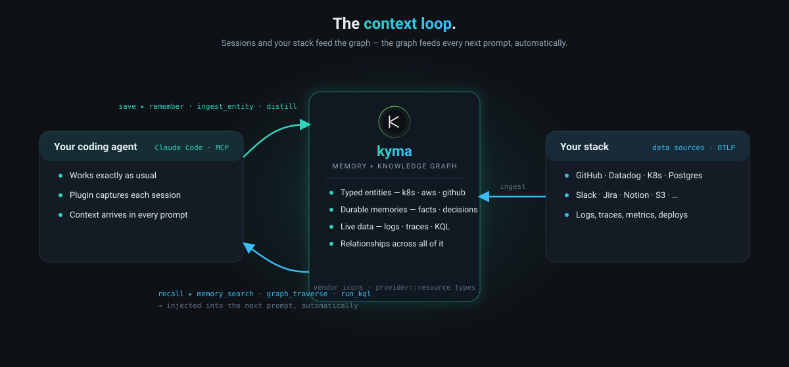
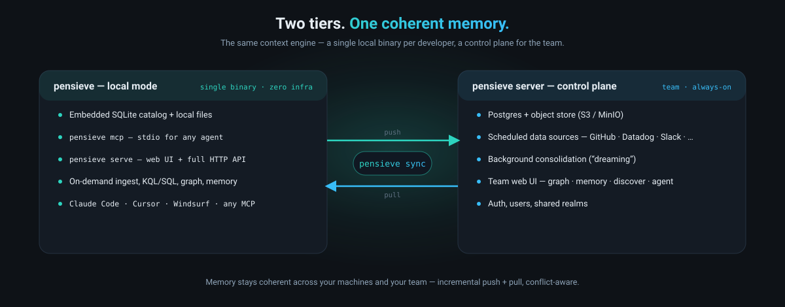
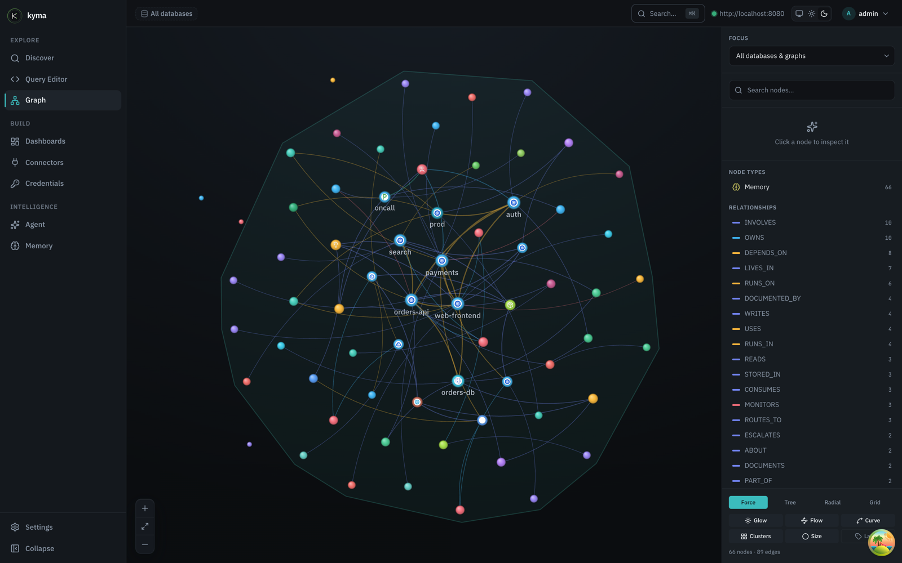

<p align="center">
  <a href="https://www.getkyma.dev">
    
  </a>
</p>

<h1 align="center">kyma</h1>

<p align="center"><strong>The context engine for coding agents.</strong></p>

<p align="center">
  Not just memory — one place your agent recalls durable, graph-aware
  <strong>memory</strong>, queries <strong>live data</strong> (logs, traces, code, connectors)
  in KQL/SQL, and walks the <strong>graph</strong> that links them.<br/>
  Connect it via a <strong>Claude Code plugin</strong>, a <strong>CLI</strong>, or <strong>MCP</strong>.
  Runs as a <strong>local single binary</strong>; syncs to your control plane.
</p>

<p align="center">
  <a href="https://www.getkyma.dev"></a>
  <a href="https://www.getkyma.dev/agent/memory"></a>
  <a href="LICENSE"></a>
  
  
</p>

<p align="center">
  <a href="#quickstart-local-zero-infra">Quickstart</a> ·
  <a href="#what-your-agent-gets">Tools</a> ·
  <a href="#two-tiers-local-binary--control-plane">Tiers</a> ·
  <a href="https://www.getkyma.dev/agent/memory">Memory</a> ·
  <a href="https://www.getkyma.dev/connectors/">Connectors</a> ·
  <a href="https://www.getkyma.dev/architecture/architecture">Architecture</a>
</p>

---

<p align="center">
  
</p>
<p align="center"><em>Your services, infra, repos, people — and your agent's memories — as one living, typed knowledge graph.</em></p>

---

A **memory store** remembers what you told it. A **context engine** also knows your
live systems and how everything connects.

Your coding agent forgets everything when the session ends — and even mid-session it
can't see your logs, your traces, the repo graph, or how a decision relates to the
service it's about. kyma gives it one place to get all of it: **durable memory**,
**live data**, and the **graph** that ties memories to the real resources they're
about — through a **Claude Code plugin**, a **CLI** any agent shells out to, or **MCP**
(stdio + HTTP). Recall *plus* live context *plus* relationships, however your agent connects.

It runs as a **single local binary** (embedded catalog + local files — no Postgres, no
Docker), wires into your agent in one command — the plugin even captures each session and
feeds the right context into every prompt **automatically** (not just on a tool call) — and
**syncs memory to a hosted control plane** so it's coherent across your machines and team.
Underneath
is a real columnar engine (Kusto-style KQL/SQL over Arrow on your object store), so
"live data" means a decade of logs/traces/connectors answered in milliseconds — not a
toy key-value store.


---

## Quickstart (local, zero infra)

**One command.** Installs the `kyma` binary, then an interactive wizard starts the
local server, connects the CLI, and wires your coding agent. No Postgres, no
Docker, **no sudo** — embedded SQLite + local files, installed to `~/.local/bin`
(pass `--dir /usr/local/bin` if you want it system-wide):

```bash
curl -fsSL https://raw.githubusercontent.com/shakedaskayo/kyma/main/install.sh | bash
```

You're now running. The wizard leaves you with:

- **Web UI + API** → **http://localhost:7777** (Graph Explorer · Memory · KQL/SQL workbench) — your first visit creates the admin user
- the server runs as a **background service** (starts at login, restarts on crash) — `kyma service status`
- **Claude Code plugin** installed → restart Claude Code and run **`/kyma-status`**
- the **`kyma` CLI** on your `$PATH`

**Try it** — a memory round-trips through the same engine the UI and your agent use:

```bash
kyma remember "payments-svc deploys behind the Aurora gateway; error budget is 0.1%."
kyma recall   "how do we deploy payments and what's the error budget?"
# → returns the memory, scored by vector + keyword + graph
```

> **Windows**: install inside [WSL2](https://learn.microsoft.com/windows/wsl/install) — the same one-liner works in the WSL shell. Native Windows support is tracked but not there yet.
>
> **Uninstall**: `curl -fsSL https://raw.githubusercontent.com/shakedaskayo/kyma/main/install.sh | bash -s -- --uninstall` (add `--purge` to also delete `~/.kyma`).

**Scripted / CI** — skip the prompts:

```bash
# install the binary only:
curl -fsSL https://raw.githubusercontent.com/shakedaskayo/kyma/main/install.sh | bash -s -- --yes
# install + start the server + install the Claude Code plugin:
curl -fsSL https://raw.githubusercontent.com/shakedaskayo/kyma/main/install.sh | bash -s -- --yes --serve --plugin
```

**Wire any agent over MCP** (zero server, zero auth — stdio):

```bash
kyma setup claude-code      # or: cursor · windsurf — writes the agent's MCP config to launch `kyma mcp`
```

Restart the agent and it has the full toolset (memory + data + graph). For Cursor /
Aider / Continue, `kyma install-skill` teaches the agent *when* to shell out to the
`kyma` CLI. The **plugin** path above goes further — it **injects the most relevant
memories into every prompt automatically** (no tool call) plus `/kyma-recall`,
`/kyma-remember`, `/kyma-ask`, `/kyma-ingest`.

**From source** (Rust toolchain + pnpm; the CLI embeds the web UI, so build it first):

```bash
git clone https://github.com/shakedaskayo/kyma && cd kyma
pnpm -C web build && cargo install --path crates/kyma-cli
# …or let the installer do it: curl -fsSL …/install.sh | bash -s -- --from-source
```

**Stay current** — the web UI ships inside the binary, so updating one updates both:

```bash
kyma update          # grab the latest release + restart the local server on the new UI
kyma update --check  # just tell me if I'm behind
```

`kyma version` / `kyma serve` also nudge (once a day, `KYMA_NO_UPDATE_CHECK=1` to opt out)
when a newer release exists.

Want it server-side for a team, with connectors and continuous ingestion? See
**[Two tiers](#two-tiers-local-binary--control-plane)**.

---

## What your agent gets

The whole context engine — not just recall — reachable however your agent connects
(plugin slash commands, the CLI, or MCP tools; same capabilities underneath):

| | Tools | What it does |
|---|---|---|
| 🧠 **Memory** | `memory_search` · `recall_memory` · `save_memory` · `list_memories` | Graph-aware hybrid recall (vector + keyword + graph), durable across sessions/machines. |
| 🕸️ **Graph** | `ingest_entity` · `link_memory_to_entity` · `graph_traverse` · `find_references_to` | Mint **virtual resources** and wire them to memories *and* real resources; walk the graph. |
| 📊 **Live data** | `run_kql` · `run_sql` · `explore_schema` · `describe_table` · `sample_rows` · `list_databases` | Query logs, traces, connector data, the catalog — in KQL or SQL, sub-second. |
| 🛠️ **Curation** | `update_memory_status` · `update_memory_importance` · `memory_compare` · `memory_judge` · `memory_session_summary` | Re-weight, archive, resolve conflicts, and record session recaps. |

> Call `memory_search` **first** when a question may depend on prior context, then follow
> the `linked` resources with `graph_traverse` for a deeper subgraph. The agent grounds
> answers in what you've actually decided *and* how your systems actually look.



### Connect it however your agent works

MCP is the standard, but it's pull-only. kyma meets your agent where it is — three paths,
same engine:

- **Claude Code plugin** (`kyma install-plugin`) — **automatic**. Hooks capture each turn
  and inject the most relevant memories into every prompt with no tool call, plus slash
  commands (`/kyma-recall`, `/kyma-remember`, `/kyma-ask`, `/kyma-ingest`, `/kyma-status`).
  The "it just remembers" path.
- **CLI, for any agent** (`kyma query "…"` · `kyma recall "…"`) — Cursor, Aider, Continue,
  or any shell-tool agent shells out; **`kyma install-skill`** writes a skill that teaches
  it *when* to reach for kyma.
- **MCP** — stdio (`kyma setup <agent>`) or HTTP (`/mcp/v1`) for native MCP clients.
  The full toolset above.

---

## Why the memory is best-in-class

kyma's memory layer synthesizes the strongest open-source patterns — and runs them over
its own columnar engine, so recall is near-realtime at scale.

- **Graph-aware hybrid retrieval** — semantic (vector `cosine_distance`) **+** keyword
  fused with Reciprocal Rank Fusion, then expanded 1–2 hops over the memory graph into a
  contextual subgraph. No LLM on the hot path.
- **Native columnar ANN** — each extent stores a centroid + radius; recall pushes a
  distance bound into the scan to prune extents (provably no false negatives).
- **Bi-temporal knowledge graph** — `valid_at` / `invalid_at`; contradictions are
  *invalidated, not deleted*, so history and point-in-time recall survive.
- **LLM extraction + automated A.U.D.N.** — `ADD / UPDATE / NOOP / INVALIDATE` conflict
  resolution; falls back to deterministic summaries with no engine configured.
- **Deterministic topic-key upsert** — a stable `topic_key` updates a memory in place
  (no LLM, no duplicates), complementing the LLM path.
- **Cross-graph links** — memories resolve to the *real* catalog nodes they're about
  (a repo, a service, a table, a trace) — the "+ graph" that makes it a context engine.
- **Provenance categories** — synthetic / extracted / connector-derived, so housekeeping
  can score and relevance-check by source. **`<private>…</private>`** is stripped before
  anything is embedded or stored.

|  | memory-only tools | **kyma** |
|---|---|---|
| Local single binary, zero infra | ✅ | ✅ |
| stdio MCP, agent-agnostic `setup <agent>` | ✅ | ✅ |
| Retrieval | keyword / vector | **vector + keyword + graph + RRF + native ANN** |
| Temporal model | soft-delete / review | **bi-temporal** + point-in-time |
| Knowledge graph | pairs / tags | **real edges + cross-graph to live resources** |
| Live data (logs/traces/SQL/KQL) | ❌ | ✅ **the same engine** |
| Control-plane sync | varies | ✅ **bidirectional** |

See **[Agentic Memory](https://www.getkyma.dev/agent/memory)** for the full design.

---

## Two tiers: local binary ↔ control plane

The same context engine, two ways to run it — pick per machine; memory stays coherent
across both via sync.



| | **`kyma` (local mode)** | **kyma server** (control plane) |
|---|---|---|
| Infra | none — embedded SQLite + local files | Postgres + object store (S3/MinIO) |
| Use | per-developer, offline, instant | team, always-on, shared |
| Memory | ✅ save / recall / graph | ✅ + background consolidation ("dreaming") |
| Live data | ✅ on-demand ingest + query | ✅ + **connectors** (GitHub, Prometheus, …) on a schedule |
| Web UI | ✅ `kyma serve` | ✅ Graph Explorer · Memory · Discover · Agent |
| Sync | ✅ `kyma sync` → control plane | ✅ receives + reconciles |

```bash
# Keep a machine's memory coherent with the team's control plane (push + pull, incremental)
KYMA_CLOUD_URL=https://kyma.your-co.dev KYMA_CLOUD_TOKEN=… kyma sync
```

**On-demand ingestion from any agent.** The bundled Claude Code plugin adds
`/kyma-ingest`: trigger a connector pull, or create virtual graph entities wired to
memory and existing resources — filling the graph without leaving your editor.

---

## See it

A WebGL canvas renders **every property graph from every database on one surface** — your
repos and services *and* the memories and entities they link to. Nodes are **color-coded by
type**, sized by connectivity, and carry **classification icons**: real vendor brand marks
(GitHub, Datadog, Kubernetes, AWS, GCP, Postgres, Redis, Kafka, Slack, PagerDuty, …) plus
`provider::resource` types like `kubernetes::pod`, `aws::ec2::instance`, and
`datadog::monitor`. Edges are colored by relationship family, communities are detected and
shaded, and the focused neighbourhood lights up with animated flow.



The web app (hosted server, or `kyma serve`) has four first-class surfaces:

- **`/graph`** — the cross-database **unified graph**: every property graph from every
  database merged onto one canvas — your repo graph, your services, cloud resources, *and*
  your memories + the entities they link to. Typed, brand-marked, color-coded nodes;
  force / tree / radial / grid layouts; search, namespace + relationship filters, community
  clustering, and a per-node inspector with one-hop expansion.
- **`/memory`** — interactive recall with scores, validity intervals, the graph path each
  result arrived by, connected resources, and live consolidation runs.
- **`/explore`** — a KQL/SQL workbench with a streaming results grid and histogram timeline.
- **`/agent`** — pick an LLM (Anthropic / OpenAI / Ollama / your local Claude Code OAuth)
  and ask production questions in English.

---

## Powered by a real engine

Most agent-memory tools sit on SQLite or a vector DB. kyma's "live data" half is a
ground-up, Rust columnar engine in the spirit of Azure Data Explorer (Kusto) — which is
what lets an agent ask twenty exploratory questions per prompt without melting a card.

- **Ingests every signal** your stack emits — logs, traces, metrics, tool calls, prompt /
  response bodies, deploy events, config diffs — via OTLP, REST, Kafka, or file-drop, plus
  scheduled connectors (GitHub / GitLab / Bitbucket / Prometheus / Postgres / S3 / Notion /
  Slack / Jira / Confluence / Gmail / Drive).
- **Stores columnar Arrow** on object storage you own, with per-extent stats + token
  indices so 99%+ of queries skip 99%+ of data (a three-level pruning cascade).
- **Answers in KQL, SQL, or PromQL** over Arrow Flight gRPC — exact rows, streamed
  zero-copy.
- **Scales from one binary to many nodes** without a rewrite: object storage is the source
  of truth, compute is stateless, the catalog is externalized.


<details>
<summary><strong>Real KQL your agent can ask today</strong> (click to expand)</summary>

```kql
// "What error signatures started appearing after the payments deploy at 14:23?"
otel_logs
| where service.name == "payments-svc" and severity_text == "ERROR"
| summarize first_seen = min(timestamp), n = count() by error_code = tostring(attributes["error.code"])
| where first_seen > datetime(2026-04-20 14:23)
| order by n desc
```

```kql
// "Walk agent session sess_a1b2 from the prompt to the tool call to the DB query."
otel_traces
| where tostring(attributes["session.id"]) == "sess_a1b2"
| project timestamp, span_name, model = tostring(attributes["llm.model"]),
          tool = tostring(attributes["tool.name"]), status_code, duration_ms
| order by timestamp asc
```

```kql
// "Which services called billing during the 02:17 spike, ranked by error rate?"
otel_traces
| where timestamp between (datetime(2026-04-20 02:15) .. datetime(2026-04-20 02:25))
| where tostring(attributes["peer.service"]) == "billing"
| summarize calls = count(), errs = sum(iff(status_code >= 500, 1, 0)) by caller = service.name
| extend err_rate = errs * 1.0 / calls
| order by err_rate desc
```

The `dynamic` column takes `llm.model`, `tool.name`, whole prompt bodies natively; a token
index makes "every session that called `send_email` with `draft:true` last Tuesday"
sub-second — not a support ticket.

</details>


Two lanes (ingest and query) share a stateless spine: object storage (source of truth) and
a catalog (Iceberg-style manifests, per-column stats, CAS commits) — Postgres on the
server, embedded SQLite in local mode. Five invariants — object storage is the only
source of truth, compute is stateless, catalog is externalized, format is pluggable,
parser is pluggable — are enforced by architectural tests. See
[`docs/architecture.md`](docs/architecture.md).

---

## Why this, not a memory SaaS or an observability vendor

- **More than memory.** Memory SaaS gives the agent facts; kyma gives it facts **+** the
  live logs/traces/code those facts are about **+** the graph linking them — one query
  surface, one MCP server.
- **Agents ask in bursts.** One prompt → twenty exploratory queries. Vendor APIs
  rate-limit and charge per query; kyma's Flight gRPC is streaming, Arrow-native, priced
  at your object-storage cost.
- **High-cardinality is native.** `session.id`, `tool.args`, `prompt.hash` explode vendor
  indexes; kyma's `dynamic` column + token index pivots on any of them, no pre-declared
  schema.
- **Your data stays yours.** Extents live on your object store; memory lives in your
  catalog. Local-first, sync opt-in.

---

## Status

**Pre-alpha.** The design is stable; the surface is not — expect schema churn and API
breaks. Shipping today: local mode in the `kyma` CLI (`mcp` · `serve` · `setup` · `sync` —
a single binary, zero infra), the agentic-memory stack (hybrid + graph recall, bi-temporal, A.U.D.N., topic-key
upsert, conflict tools, provenance, export/import), the MCP server (stdio + HTTP), REST/OTLP/
Kafka/file-drop ingest, scheduled connectors, KQL + SQL over Arrow Flight, the 3-level
pruning cascade, the web app, compaction/retention/GC, and bidirectional memory sync.
Next: PromQL · Flight-SQL · multi-node read scale-out · cross-region federation.

The fastest front door: the **[local quickstart](#quickstart-local-zero-infra)** above,
or the docker-compose dev stack (`docker compose up -d`) for the full server tier.

---

## Workspace layout

```
crates/
  kyma-core/            traits + types; the architectural contract
  kyma-catalog/         Postgres-backed catalog (Iceberg-mirroring metadata)
  kyma-catalog-sqlite/  embedded SQLite catalog (powers local mode)
  kyma-storage/         object_store wrapper + local-FS auto-select
  kyma-format-tlm/      telemetry storage format (Arrow + stats + token index)
  kyma-ingest-*/        staging/commit write path + REST/OTLP/Kafka/file-drop frontends
  kyma-kql/ kyma-plan/ kyma-exec/   KQL → unified plan → DataFusion execution
  kyma-memory/          agentic memory: schema, writer, hybrid+graph recall
  kyma-mcp/             MCP server — stdio + HTTP transports, shared dispatch
  kyma-server/          HTTP + Flight gRPC API, agent surface, auth, web UI
  kyma-connectors/      connector framework (GitHub, Prometheus, SaaS, …)
  kyma-compaction/      background compaction, retention, physical GC
  kyma-local/           local-engine library behind `kyma` mcp · serve · setup · sync
  kyma-cli/             the `kyma` CLI — client + admin + local engine (one binary)
  kyma-bin/             the full server binary (the docker/control-plane tier)
```

Full docs at **[getkyma.dev](https://www.getkyma.dev)**.

---

## License & contributing

[MIT](LICENSE). See [CONTRIBUTING.md](CONTRIBUTING.md); for security issues follow
[SECURITY.md](SECURITY.md) rather than the public tracker.
