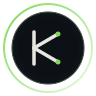
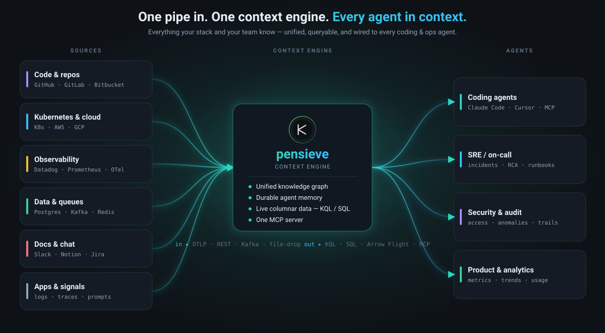
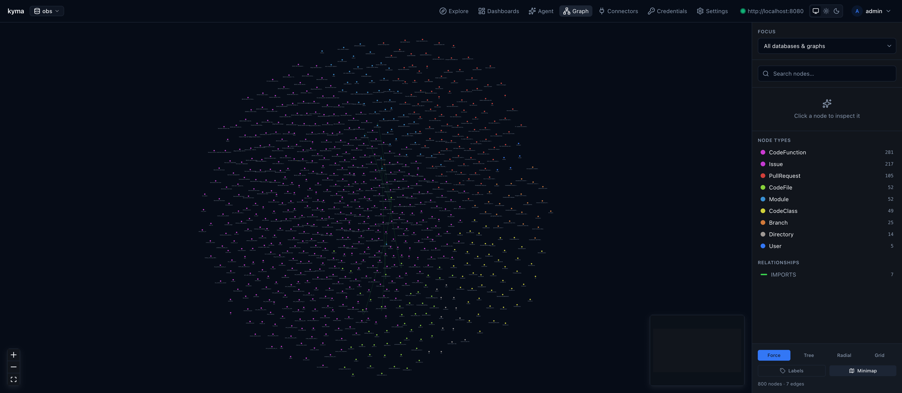

<p align="center">
  <a href="https://www.getkyma.dev">
    
  </a>
</p>

<h1 align="center">kyma</h1>

<p align="center"><strong>Production knowledge, as a query.</strong></p>

<p align="center">
  <a href="https://www.getkyma.dev"></a>
  <a href="LICENSE"></a>
  
  
</p>

<p align="center">
  <a href="https://www.getkyma.dev/quickstart/five-minute-start">Quickstart</a> ·
  <a href="https://www.getkyma.dev/concepts/">Concepts</a> ·
  <a href="https://www.getkyma.dev/architecture/architecture">Architecture</a> ·
  <a href="https://www.getkyma.dev/connectors/">Connectors</a> ·
  <a href="https://www.getkyma.dev/recipes/">Recipes</a>
</p>

---

Point every OTLP emitter in your stack — services, Kubernetes, CI, databases,
queues, frontend RUM, your agents themselves — at one engine. Then let your
agents ask it anything, in KQL or SQL, at sub-second latency over a decade of
history. No dashboards to scrape. No vendor APIs to juggle. No rate limits.

kyma is a ground-up, Rust-based, distributed-ready data engine in the spirit of
Azure Data Explorer (Kusto) — purpose-built to be the **answer layer** for
agents that need production awareness across the whole stack.

It's also a **context engine** for coding agents: not just agentic *memory*, but
one MCP surface where an agent recalls durable memories **and** queries live data
(logs, traces, connectors, the catalog) in KQL/SQL **and** traverses the graph
that links them. Memory is graph-aware — hybrid vector+keyword+graph recall,
bi-temporal validity, LLM extraction with automated conflict resolution,
deterministic topic-key upsert, and agent-driven conflict tools — and links back
to the real resources it's about. See **[Agentic Memory](https://www.getkyma.dev/agent/memory)**.

Full docs live at **[getkyma.dev](https://www.getkyma.dev)**.



---

## See it



The **Graph Explorer** at `/graph` is one of three first-class
surfaces in the web app:

- **/explore** — KQL/SQL workbench with a streaming results grid,
  histogram timeline, and per-tab state.
- **/agent** — the Kyma Agent: pick an LLM provider (Anthropic /
  OpenAI / Ollama / your local Claude Code OAuth), enable the skills
  it should use, and ask production questions in English.
- **/graph** — the cross-database unified graph. Every property
  graph from every database, merged onto one canvas; the pruning
  cascade keeps even decade-scale topology queries interactive.

---

## Ask Kyma from any coding agent

Kyma ships a CLI that turns it into a tool any coding assistant
(Claude Code, Cursor, Aider, Continue, …) can shell out to. Three
commands and your agent can query production:

```bash
cargo install --path crates/kyma-cli
kyma connect http://localhost:8080 --token "<bearer>"
kyma install-skill --also-link-claude

# Then from your terminal — or from inside Claude Code:
kyma query "any error logs from prod-api in the last 15 minutes?"
```

The skill teaches the outer agent *when* to shell out; Kyma's own
agent loop (with engine + tools + skills + pruning) answers in KQL.
See [docs/site/agent/](docs/site/agent/index.md) for the full surface.

---

## Connect a GitHub repo in one command

The same CLI provisions and triggers connectors. Token is auto-
discovered from `$GITHUB_TOKEN`, `$GH_TOKEN`, or `gh auth token`:

```bash
kyma create-database github
kyma connector add github shakedaskayo/kyma --start
# Created connector gh-shakedaskayo-kyma (github) → id=…
#   database:      github
#   credential:    …
#   schedule:      every 300000ms
#
# Triggering first run...
#   [2026-05-31T09:06:58Z] success — last_success_at=…
```

Two tables (`github_nodes`, `github_edges`) and a property graph
named `github` are auto-registered. Visit `/graph` to see them.
GitLab and Bitbucket work the same way — `kyma connector add
gitlab …` / `kyma connector add bitbucket …`. See
[docs/site/connectors/github.md](docs/site/connectors/github.md).

---

## What kyma is

A single unified data engine that:

- **Ingests every signal** your stack already emits — logs, traces, metrics,
  spans, tool calls, prompt and response bodies, deploy events, config diffs,
  audit trails — through one OTLP pipe (plus REST, Kafka, and file-drop for
  non-OTLP sources).
- **Stores it as columnar Arrow** on object storage you own (S3 / MinIO / any
  `object_store`), with per-extent column statistics and token indices that
  make 99 %+ of queries skip 99 %+ of data.
- **Answers in KQL, SQL, or PromQL** over Arrow Flight gRPC — exact rows,
  streamed zero-copy — so an agent can ask twenty exploratory questions per
  user prompt without melting a credit card.
- **Scales from one binary to many nodes** without a rewrite: the catalog is
  externalized from byte one, compute is stateless, object storage is the
  source of truth. Multi-node read scale-out and cross-region federation
  layer on as peers of the single-node path — not as replacements for it.

Think of it as the data plane an agent *wishes* existed behind every
"how's production doing?" question.

---

## How it works



Two lanes — ingest and query — share a stateless spine made of object storage
(source of truth) and a Postgres-backed catalog (Iceberg-style manifests,
per-column stats, CAS commits). Nothing durable lives on a compute node.

**Ingest** flows left-to-right. OTLP, REST, Kafka, and file-drop frontends
normalize signals into Arrow RecordBatches. A per-table staging buffer
group-commits with pipelined flushes so hundreds of concurrent emitters
produce a small number of fat, well-formed extents instead of a flood of tiny
ones. The commit coordinator batches multiple extents into a single snapshot,
drops catalog-CAS conflicts to near-zero, and keeps per-table writes ordered
without serializing across tables. An ALTER TABLE mid-ingest is handled by
force-flushing the buffer before appending a new-schema batch — history is
never rewritten; reads null-fill missing columns.

**Query** is a three-level pruning cascade. A KQL / SQL / PromQL frontend
parses to a unified logical plan. The planner asks the catalog for candidate
extents using time-range, equality sets, and token-containment predicates —
eliminating almost all extents on almost all queries without touching object
storage. Surviving extents are range-GET'd for their footers, pruned again
with per-block stats and posting lists, and only then decoded. DataFusion
executes the resulting plan vectorized on Arrow, streaming results to the
client over Flight gRPC.

The five invariants that make this distributable without a rewrite — object
storage is the only source of truth, compute is stateless, catalog is
externalized, format is pluggable, parser is pluggable — are enforced by
architectural tests. See [`docs/architecture.md`](docs/architecture.md).

---

## An agent's trip through kyma


The numbers matter. Every order-of-magnitude reduction at a pruning level is
an order of magnitude of latency, object-storage bandwidth, and dollars the
agent is *not* paying on its next exploratory query. That's what makes kyma
agent-shaped: an agent answering one question asks twenty; those twenty need
to stay cheap.

---

## What your agents can ask

These are real KQL queries against kyma today. Drop them into any agent's
tool-call layer (Flight gRPC or HTTP) and you have a production-aware
copilot the same afternoon.

### Post-deploy error emergence

> *"What error signatures started appearing after the payments deploy at 14:23?"*

```kql
otel_logs
| where service.name == "payments-svc"
| where timestamp between (ago(2h) .. now())
| where severity_text == "ERROR"
| summarize first_seen = min(timestamp), n = count() by error_code = tostring(attributes["error.code"])
| where first_seen > datetime(2026-04-20 14:23)
| order by n desc
| take 20
```

### Agent-session post-mortem

> *"Why did agent session `sess_a1b2` fail? Walk me from the prompt to the tool call to the downstream DB query."*

```kql
otel_traces
| where tostring(attributes["session.id"]) == "sess_a1b2"
| project timestamp,
          span_name,
          model = tostring(attributes["llm.model"]),
          tool  = tostring(attributes["tool.name"]),
          url   = tostring(attributes["http.url"]),
          status_code,
          duration_ms
| order by timestamp asc
```

This query is the point of the whole engine. Vendor telemetry backends
weren't designed to index `llm.model`, `tool.name`, or whole prompt bodies.
kyma's `dynamic` column takes them natively — and a token index on
`tool.args` means "every session that called `send_email` with `draft: true`
last Tuesday" is sub-second, not a support ticket.

### Blast-radius fan-out during an outage

> *"Which services called billing during the 02:17 spike, ranked by error rate?"*

```kql
otel_traces
| where timestamp between (datetime(2026-04-20 02:15) .. datetime(2026-04-20 02:25))
| where tostring(attributes["peer.service"]) == "billing"
| summarize calls = count(),
            errs  = count() * iff(status_code >= 500, 1, 0)
    by caller = service.name
| extend err_rate = errs * 1.0 / calls
| order by err_rate desc
```

### Change surface over the last day

> *"What changed in the last 24h — new error signatures, new span names, unusual resource attributes?"*

```kql
otel_traces
| where timestamp > ago(24h)
| summarize first_seen = min(timestamp), n = count()
    by span_name, service.name
| where first_seen > ago(24h)
| order by first_seen desc
```

### Latency regression, narrowed

> *"Which span on `payments-svc` got slower in the last hour versus the previous hour?"*

```kql
otel_traces
| where service.name == "payments-svc"
| where timestamp > ago(2h)
| extend bucket = iff(timestamp > ago(1h), "now", "prev")
| summarize p = avg(duration_ms) by span_name, bucket
| order by span_name asc
```

### Cost attribution over the quarter

> *"Which tenants burned the most LLM tokens in Q2, by model?"*

```kql
otel_logs
| where timestamp between (datetime(2026-04-01) .. datetime(2026-06-30))
| where span_name == "llm.call"
| summarize total = sum(toint(attributes["llm.tokens.total"]))
    by tenant = tostring(attributes["tenant.id"]),
       model  = tostring(attributes["llm.model"])
| order by total desc
| take 50
```

---

## Why this and not $VENDOR

Why not just send OTLP to Datadog, Honeycomb, or Grafana Cloud and point your
agent at their API? A few hard reasons:

- **Agents ask in bursts.** One user prompt turns into twenty exploratory
  queries. Vendor APIs rate-limit per-minute and charge per-query; kyma's
  Flight gRPC is streaming, Arrow-native, and priced at whatever your object
  storage costs.
- **Agent telemetry is high-cardinality.** `session.id`, `tool.name`,
  `tool.args`, `prompt.hash`, `llm.model` explode vendor indexes and
  quickly hit ingestion caps. kyma's `dynamic` column takes arbitrary
  structured attributes with a token index — the agent pivots on any of
  them without pre-declaring a schema.
- **Vendor query languages are agent-hostile.** Datadog Query, LogQL, and
  custom DSLs return charts or screenshots, not rows. An agent needs
  deterministic, composable results — KQL + Arrow is built for that.
- **Your data stays yours.** Extents live on your object store. Retention,
  export, replay, and schema evolution are yours to control, not a vendor
  config knob.
- **Agent-specific retention policies.** Keep every error trace 90 days,
  sample successful traces at 1 %, keep every LLM call with
  `user_feedback == "bad"` forever — all as first-class catalog policies,
  not something you reverse-engineer from log router config.
- **One language across signals.** Join a log line against the trace that
  emitted it against the metric that alerted on it against the deploy event
  that preceded them — in one KQL query. No stitching across three vendor
  products.
- **Distributed by design, single-node to start.** The catalog lives in a
  separate process on day one. Moving to multi-node is a deployment change,
  not a rewrite.

kyma is the difference between *"ask the observability vendor for a chart"*
and *"give the agent a database and let it think."*

---

## Quick start

```bash
# bring up Postgres (5433) + MinIO (9000 / console 9001)
docker-compose up -d

# build and run the engine (HTTP 8080, Flight gRPC 9090)
cargo run --release -p kyma-bin

# smoke test
curl -sS http://localhost:8080/health
curl -sS http://localhost:8080/metrics | head -20
```

Ingest some rows:

```bash
curl -sS -X POST http://localhost:8080/v1/ingest \
  -H "X-Database: obs" \
  -H "X-Table: otel_logs" \
  -H "Content-Type: application/x-ndjson" \
  --data-binary @- <<'EOF'
{"timestamp":"2026-04-20T14:23:01Z","service.name":"payments-svc","severity_text":"ERROR","message":"card declined","attributes":{"error.code":"CARD_DECLINED"}}
{"timestamp":"2026-04-20T14:23:04Z","service.name":"payments-svc","severity_text":"ERROR","message":"card declined","attributes":{"error.code":"CARD_DECLINED"}}
EOF
```

Query in KQL:

```bash
curl -sS -X POST http://localhost:8080/v1/query \
  -H "X-Database: obs" \
  -H "Content-Type: application/x-kql" \
  --data-binary 'otel_logs | where severity_text == "ERROR" | summarize n = count() by error_code = tostring(attributes["error.code"])'
```

Query in SQL (same endpoint, `Content-Type: application/sql`) or in Rust /
Python / anything else over Arrow Flight on port 9090. The end-to-end test
suites under [`scripts/`](scripts/) — `e2e-test.sh`, `test-kql.sh`,
`test-flight.sh`, `load-test.sh`, `chaos-test.sh`, and ten more — are a good
tour of what the engine can do.

---

## Workspace layout

```
crates/
  kyma-core/              traits + types; the architectural contract
  kyma-format-tlm/        telemetry storage format (Arrow + stats + token index)
  kyma-format-stub-vec/   vector-format stub proving the SegmentFormat boundary
  kyma-catalog/           Postgres-backed catalog (Iceberg-mirroring metadata)
  kyma-storage/           object_store wrapper + block cache
  kyma-ingest-core/       staging buffer, commit coordinator, write path
  kyma-ingest-rest/       HTTP ingest frontend
  kyma-ingest-otlp/       OTLP gRPC ingest frontend
  kyma-ingest-kafka/      Kafka ingest frontend
  kyma-ingest-filedrop/   object-storage file-drop ingest frontend
  kyma-kql/               KQL parser + translator
  kyma-plan/              unified logical plan IR
  kyma-exec/              DataFusion integration, pushdown extractors
  kyma-compaction/        background compaction, retention, physical GC
  kyma-server/            HTTP + Arrow Flight gRPC query API, auth, metrics
  kyma-cli/               admin CLI
  kyma-bin/               the binary
```

See [`docs/architecture.md`](docs/architecture.md) for the living design
document and [`docs/benchmarks.md`](docs/benchmarks.md) for honest numbers
against Elasticsearch / ClickHouse / ADX / InfluxDB 3.0.

---

## Roadmap

| State      | Capability                                                                                             |
|------------|--------------------------------------------------------------------------------------------------------|
| shipping   | REST ingest, staging buffer + commit coordinator, KQL, SQL via DataFusion, Arrow Flight gRPC            |
| shipping   | 3-level pruning cascade (catalog · extent footer · block/index) — time range, equality, token-contains |
| shipping   | Postgres catalog with CAS, Iceberg-style manifests, schema evolution (ALTER TABLE ADD COLUMN)           |
| shipping   | Compaction, retention, soft-delete + physical GC workers                                                |
| shipping   | Auth (bearer token + roles), metrics (Prometheus), idempotency, query budgets, exponential retry       |
| in flight  | Custom telemetry format v1 — Gorilla floats, delta-of-delta timestamps, FST term dicts, full inverted  |
| next       | OTLP gRPC ingest · Kafka ingest · file-drop watcher                                                    |
| next       | Native MCP server surface so agents connect directly, no glue code                                     |
| next       | PromQL frontend · Flight-SQL compliance                                                                |
| later      | Multi-node read scale-out (extent-cache-aware planner)                                                 |
| later      | Cross-region federation                                                                                |
| later      | Vector / agent-memory column format (ANN index + metadata join)                                        |

Slice 1 is single-node. The architecture is designed so multi-node,
multi-cluster, and distributed deployments are a bolt-on, never a rewrite.

---

## Status

Pre-alpha. The design is stable; the surface is not. Expect schema churn, API
breaks, and unfinished ingest frontends. If you want to kick tires, the
docker-compose dev stack plus the `scripts/` test suite is the front door.

---

## License

[Apache License 2.0](LICENSE).

## Contributing

See [CONTRIBUTING.md](CONTRIBUTING.md). Security issues: please follow
[SECURITY.md](SECURITY.md) rather than the public issue tracker.
