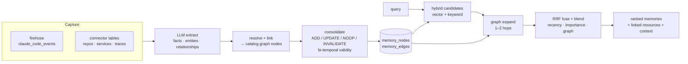

# Agentic Memory

> **Memory is one half of Kyma's *context engine*.** Through the same MCP server,
> an agent doesn't only recall stored facts — it queries **live data** (logs,
> traces, connectors, the catalog) in KQL/SQL and traverses the **graph** that
> links memories to the real resources they're about. Recall **+** live context
> **+** relationships, in one place. That's the difference between a memory store
> and a context engine.

Kyma gives agents a **persistent memory** that survives across sessions and
machines: durable facts, decisions, preferences, learnings, and procedures —
linked to the real resources they're about (repos, services, tables, traces)
and recalled in near-realtime. It's built on Kyma's own columnar engine and
graph layer, so memory is first-class queryable (KQL/SQL/Discover) and renders
in the unified graph alongside everything else Kyma ingests.

The design synthesizes the strongest open-source patterns: **Mem0**-style LLM
fact extraction with `ADD / UPDATE / NOOP / INVALIDATE` conflict resolution, and
**Zep/Graphiti**-style bi-temporal validity (invalidate, don't delete) and
hybrid + graph retrieval.

> **The use case.** A coding agent (Claude Code, Cursor, …) connected to Kyma
> remembers your conventions and decisions, knows which service a fact is about,
> and pulls the right context onto each prompt — without you re-explaining.

## The lifecycle



**Ingestion** runs in the background (the consolidation pipeline). **Recall**
runs on the hot path with **no LLM** — vector + keyword candidates fused with
Reciprocal Rank Fusion, then graph-expanded over the memory edges into a
contextual subgraph.

## What gets remembered

Extraction produces **atomic** memories, each typed:

| Type | Meaning |
| --- | --- |
| `fact` | A stable truth ("the payments service owns the `ledger` table"). |
| `decision` | A choice made ("we standardized on pgvector for embeddings"). |
| `preference` | How you like things done ("prefer KQL over SQL in examples"). |
| `learning` | A cause→fix ("the flaky test failed on timezone; pin TZ=UTC"). |
| `procedure` | A convention / runbook ("deploy = tag, then `make release`"). |
| `entity` | A lightweight node for a person/repo/service/file/table/config, linked to the real catalog node. |
| `summary` | A deterministic activity digest (the no-LLM fallback). |

Each memory carries an `importance` (0–1), a `realm` (namespace — usually the
project, plus a shared `global`), a `status` (`active`/`background`/`archived`),
and **bi-temporal validity**: `valid_at` (when it became true) and `invalid_at`
(when it was superseded — `NULL` means currently valid). Contradicted memories
are **invalidated, not deleted**, so history and point-in-time recall survive.

Memories connect through typed **edges**:

| Edge | From → To |
| --- | --- |
| `REFERENCES` | memory → an entity it's about |
| `RESOLVES_TO` | a memory-side entity → the real catalog graph node (cross-graph) |
| `RELATES_TO` | entity ↔ entity (predicate in `props`) |
| `DERIVED_FROM` | memory → the source event/row it was extracted from |
| `INVALIDATES` | a new memory → the memory it supersedes |
| `MERGED_INTO` | a memory → the memory it was folded into |

## How recall works

Recall is **graph-aware hybrid search**, designed to "find anything fast":

1. **Candidates, in parallel** — semantic (vector `cosine_distance`) and keyword
   (token-set `LIKE`, which the columnar engine prunes via per-extent stats).
2. **Bi-temporal filter** — invalidated memories drop out (unless you ask for a
   point-in-time `as_of` or `include_invalidated`).
3. **RRF fusion** — the two ranked lists are fused (`1/(k+rank)`).
4. **Graph expansion** — the top hits seed a 1–2 hop walk over `memory_edges`,
   pulling in connected memories **and** the catalog resources/traces they link
   to (via `target_namespace`).
5. **Blend** — a final score combines RRF, semantic similarity, keyword overlap,
   graph proximity, importance, and recency. No LLM in the default path.

The result is a ranked list of memories **plus** a `linked` list of connected
resources **plus** a ready-to-inject `context` block.

### Near-realtime at scale: native ANN

Vector recall is accelerated by a **native columnar ANN index** — each extent
stores a centroid + radius for its embedding column (on the unit sphere, where
the bound is provably correct for cosine). When the `ann_threshold` setting is
on, recall pushes a distance predicate down to the scan, pruning extents that
can't contain a near neighbor. It's conservative (no false negatives) and falls
back to an exact scan for any extent lacking the stat.

## Surfaces

### For coding agents — the MCP tool

Agents connected to Kyma's MCP server get `memory_search` (and `save_memory`,
`recall_memory`, `list_memories`, `link_memory_to_entity`):

```jsonc
// tools/call memory_search
{
  "query": "how do we run the release?",
  "limit": 8,
  "expand_hops": 1          // pull connected resources/traces too
}
// → { memories: [...], linked: [...], context: "Relevant memories:\n- [procedure] ..." }
```

Call it **first** when a question may depend on prior context, decisions, or how
entities relate; then follow `linked` node ids with `graph_traverse` for a
deeper subgraph.

**Writing & curating.** `save_memory` takes structured `why` / `where` /
`learned` fields (folded into the body) and an optional **`topic_key`** — a
stable key (e.g. `architecture/auth-model`) so a later save with the same
`realm`+`topic_key` **updates the memory in place** instead of duplicating
(deterministic, no LLM). `update_memory_status` / `update_memory_importance`
re-weight or archive during housekeeping. `memory_session_summary` records a
structured end-of-session recap (goal / instructions / discoveries /
accomplished / next steps / files) for the next session to resume from.

**Resolving conflicts.** When recall surfaces a contradiction, `memory_compare`
fetches two memories side by side and `memory_judge` records the verdict on the
graph: `supersedes` invalidates the target (bi-temporal — it drops from default
recall but stays for audit), `merged` archives it, and
`conflicts`/`related`/`compatible` write a `RELATES_TO` edge.

**Privacy.** Content wrapped in `<private>…</private>` is stripped at the store
layer before anything is embedded or persisted.

### HTTP API

```bash
# Near-realtime recall (no LLM). mode:"agentic" adds a synthesized brief.
curl -X POST http://localhost:8080/v1/agent/memory/query \
  -H 'content-type: application/json' \
  -d '{ "query": "what did we decide about embeddings?", "expand_hops": 1 }'
```

Response: `{ memories[], linked[], context, brief?, took_ms }`. Filters:
`realms`, `memory_type`, `tags`, `importance_min`, `as_of`, `include_invalidated`,
`limit`, `expand_hops`.

**Backup / portability.** `GET /v1/agent/memory/export[?realm=]` returns the
full snapshot (latest node versions + edges, including embeddings) as JSON.
Re-import on another instance via the idempotent `POST /v1/ingest`
(`X-Database: memory`, `X-Table: memory_nodes|memory_edges`, NDJSON) — so a
machine's memory is portable and re-syncs cleanly.

### The Memory workspace (web)

The `/memory` page has three tabs:

- **Search** — run recall interactively; see scores, validity intervals, the
  graph path each result arrived by, and connected resources.
- **Ingestion** — realtime view of the firehose, the memory store, and
  consolidation-pipeline runs (with extraction vs deterministic mode + counts).
- **Settings** — tune everything below, live.

### Claude Code plugin

The bundled plugin wires the firehose, recall injection, and session-end
distillation into Claude Code's hooks. See
[Claude Code memory plugin](/agent/claude-code-plugin).

## Tuning

Every knob is editable from **Memory → Settings** (or
`PUT /v1/agent/memory/settings`) and applied without a redeploy:

| Setting | What it controls |
| --- | --- |
| `extraction_enabled` | LLM extraction + conflict resolution vs deterministic summaries. |
| `min_events` | How much new firehose activity a project needs before it's consolidated. |
| `default_limit` / `default_expand_hops` | Recall defaults when a query doesn't override them. |
| `ann_threshold` | Native-ANN cosine cutoff for extent pruning. `0` = off (exact scan). |
| `w_rrf` · `w_semantic` · `w_keyword` · `w_graph` · `w_importance` · `w_recency` | The hybrid relevance blend. |
| `half_life_days` | Recency decay half-life. |
| `rrf_k` | Reciprocal-rank-fusion constant. |

```bash
curl http://localhost:8080/v1/agent/memory/settings            # read
curl -X PUT http://localhost:8080/v1/agent/memory/settings \
  -H 'content-type: application/json' \
  -d '{ "extraction_enabled": true, "w_graph": 0.7, "ann_threshold": 0.0, ... }'
```

## Engine & embeddings

Extraction and the optional `agentic` recall brief reuse the **configured agent
engine** (Anthropic / OpenAI / Ollama — see [Engines](/agent/engines)). With no
usable engine (or the Claude Code CLI engine, which doesn't run through the
adk path), ingestion **falls back to deterministic summaries** — recall still
works fully. Embeddings come from the same backend that powers schema RAG
(`fastembed` by default; see [Dynamic and vectors](/concepts/dynamic-and-vectors)).

## End-to-end: a coding agent that remembers

```bash
# 1. Connect a terminal / coding agent to Kyma and install the plugin.
kyma connect http://localhost:8080 --token <bearer>
kyma install-plugin

# 2. Work normally in Claude Code. Hooks firehose your turns into
#    default.claude_code_events; the consolidation pipeline distills them
#    into durable memories (extraction when an engine is set).

# 3. On the next prompt, the UserPromptSubmit hook recalls relevant context:
kyma recall "how do we handle DB migrations?"
# - [procedure] Migrations live in crates/kyma-catalog/migrations, numbered NNN_*.sql ...
# - [decision] We invalidate-don't-delete superseded facts (bi-temporal) ...

# 4. Inspect or tune anything in the web app at /memory.
```

The agent now grounds answers in what you've actually decided and how your
resources relate — and finds it in milliseconds.

## See also

- [Claude Code memory plugin](/agent/claude-code-plugin) — the hooks integration.
- [The agent loop](/concepts/the-agent-loop) — the `/v1/agent/ask` surface and tools.
- [Dynamic and vectors](/concepts/dynamic-and-vectors) — embeddings and vector search.
- [Connect a coding agent](/agent/connect-from-cli) — wiring `kyma` into your tools.
