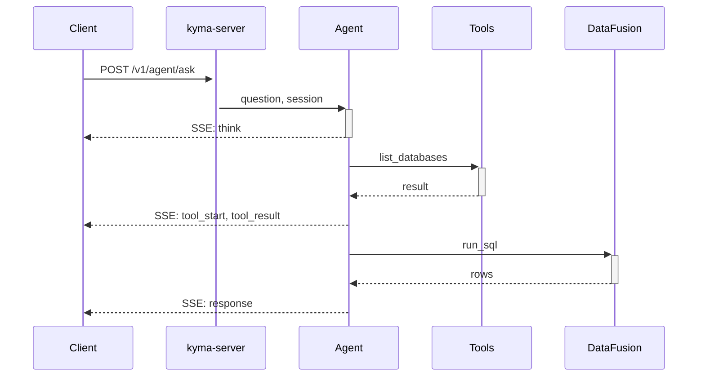

# Docs D1 — Core Hand-Written Content Implementation Plan

> **For agentic workers:** REQUIRED SUB-SKILL: Use superpowers:subagent-driven-development (recommended) or superpowers:executing-plans to implement this plan task-by-task. Steps use checkbox (`- [ ]`) syntax for tracking. **Prerequisite:** [Docs D0 Scaffolding](2026-05-02-docs-d0-scaffolding.md) is complete and committed.

**Goal:** Fill in the four narrative sections — Quickstart, Concepts, Ingest, Query — with hand-written content that gets a new operator from "what is kyma?" to "I just ran my first cross-source query" without ever opening the source code. Each page follows the page-template patterns from spec §4.4. Mermaid + SVG diagrams are added where they explain better than prose. The Reference, Connectors, Recipes, and Architecture sections stay as placeholders (they land in D2, M1+, D4 respectively).

**Architecture:** D1 is mostly markdown plus a few diagrams. No new components, no build pipeline changes. Per spec §11.1, this milestone is "content volume; needs a writer + review" — the implementation lift is small per file but spans many files. Each page hits a strict template so reviewers can move fast.

**Tech Stack:** VitePress (already wired in D0), Mermaid (in-code blocks), SVG diagrams under `docs/site/public/diagrams/`. Content sourced from: kyma `README.md`, `docs/architecture.md`, `docs/benchmarks.md`, the spec inventories from background research, and the existing OTLP / REST / KQL / SQL / Flight surface as inventoried during the brainstorm.

---

## File Structure

**New files (under `docs/site/`):**

Quickstart (3 pages):
- `quickstart/five-minute-start.md` — `docker compose up` → first KQL query.
- `quickstart/first-real-run.md` — REST ingest + KQL + agent endpoint.
- `quickstart/concepts-cheatsheet.md` — one-page mental model for new users.

Concepts (10 pages):
- `concepts/what-is-kyma.md`
- `concepts/the-pruning-cascade.md`
- `concepts/extents-and-snapshots.md`
- `concepts/schema-model.md`
- `concepts/dynamic-and-vectors.md`
- `concepts/the-agent-loop.md`
- `concepts/the-five-invariants.md`
- `concepts/multi-source-data.md` — federation + sync overview.
- `concepts/retention-and-compaction.md`
- `concepts/observability.md`

Ingest (5 pages):
- `ingest/rest-ndjson.md`
- `ingest/otlp-grpc.md`
- `ingest/kafka.md`
- `ingest/file-drop.md`
- `ingest/idempotency-and-coercion.md`

Query (5 pages):
- `query/kql.md`
- `query/sql.md`
- `query/promql.md` — clearly marked "shipping next per roadmap."
- `query/arrow-flight.md`
- `query/agent-endpoint.md`
- `query/pruning-and-performance.md`

Diagrams (port + new):
- `public/diagrams/fan-in.svg` — copied from `docs/images/fan-in.svg`.
- `public/diagrams/architecture.svg` — copied from `docs/images/architecture.svg`.
- `public/diagrams/agent-query-lifecycle.svg` — copied from `docs/images/agent-query-lifecycle.svg`.
- `public/diagrams/pruning-cascade.svg` — new, generated from a Mermaid flowchart and exported.
- `public/diagrams/multi-source-flow.svg` — new, federation+sync flow.

**Modified files:**

- `docs/site/.vitepress/config.ts` — populate the `sidebar` arrays for each section now that real pages exist.
- `docs/site/quickstart/index.md`, `concepts/index.md`, `ingest/index.md`, `query/index.md` — replace D0 placeholders with section landings (one-paragraph intros + a card grid linking to the new pages).

---

## Task 1: Port existing diagrams

**Files:**
- Copy: `docs/images/{fan-in,architecture,agent-query-lifecycle}.svg` → `docs/site/public/diagrams/`

- [ ] **Step 1: Copy three SVGs**

```bash
cp docs/images/fan-in.svg docs/site/public/diagrams/fan-in.svg
cp docs/images/architecture.svg docs/site/public/diagrams/architecture.svg
cp docs/images/agent-query-lifecycle.svg docs/site/public/diagrams/agent-query-lifecycle.svg
```

- [ ] **Step 2: Verify the validator still passes** (no broken icon refs):

```bash
cd docs/site && pnpm check:diagrams
```

Expected: PASS.

- [ ] **Step 3: Commit**

```bash
git add docs/site/public/diagrams/{fan-in,architecture,agent-query-lifecycle}.svg
git commit -m "docs(d1): port existing kyma diagrams into the site"
```

---

## Task 2: Quickstart — five-minute start

**Files:**
- Create: `docs/site/quickstart/five-minute-start.md`

- [ ] **Step 1: Write the page**

Template:

```markdown
---
title: Five-minute start
description: docker compose up to your first KQL query in under five minutes.
---

# Five-minute start

This walks you from a fresh clone to a working query against a kyma instance,
in under five minutes.

## Prerequisites

- Docker + Docker Compose installed.
- ~2 GB of free RAM.
- A terminal.

## Step 1: Boot kyma

```bash
git clone https://github.com/shaked/engine.git
cd engine
docker compose up -d
```

That brings up four containers: kyma itself, Postgres (catalog), MinIO
(object store), and Redpanda (Kafka). Wait for the kyma container to log
`HTTP listening on :8080`.

## Step 2: Send a log

```bash
curl -X POST http://localhost:8080/v1/ingest \
  -H 'Content-Type: application/x-ndjson' \
  -H 'X-Database: default' \
  -H 'X-Table: hello' \
  -d '{"timestamp": "2026-05-02T10:00:00Z", "service_name": "demo", "message": "hello kyma"}'
```

You should get back a JSON envelope:

```json
{ "snapshot_id": "...", "extent_count": 1, "rows_ingested": 1, "bytes_written": 234, "replayed": false }
```

## Step 3: Query it back

```bash
curl -X POST http://localhost:8080/v1/query \
  -H 'Content-Type: application/x-kql' \
  -d 'hello | where service_name == "demo" | take 10'
```

You'll get the row back as Arrow IPC (or, with the right `Accept` header,
JSON). Congratulations — you have a working kyma.

## What just happened

1. **Ingest** — your NDJSON went through the REST frontend, was coerced
   into Arrow, group-committed via the staging buffer, and persisted as one
   tiny extent in MinIO with a manifest in Postgres.
2. **Query** — the KQL parser produced a logical plan, the planner asked
   the catalog which extents could match (one), DataFusion executed the
   filter on the decoded Arrow, and the rows came back over HTTP.

## Next steps

- [Concepts: What kyma is](/concepts/what-is-kyma) — the 10-minute mental model.
- [First real run](/quickstart/first-real-run) — agent endpoint + ingest from a real source.
- [Ingest: REST/NDJSON](/ingest/rest-ndjson) — schema, idempotency, batch shape.
```

- [ ] **Step 2: Verify the page renders**

```bash
cd docs/site && pnpm dev
```

Visit `/quickstart/five-minute-start`. Confirm formatting + code blocks render.

- [ ] **Step 3: Commit**

```bash
git add docs/site/quickstart/five-minute-start.md
git commit -m "docs(d1): quickstart — five-minute start"
```

---

## Task 3: Quickstart — first real run

**Files:**
- Create: `docs/site/quickstart/first-real-run.md`

- [ ] **Step 1:** Write covering: pointing an OTLP collector at port 4317; running a multi-row REST batch; a slightly more interesting KQL query (`summarize n=count() by service_name`); a single agent question via `/v1/agent/ask` (SSE example).

Reference the spec inventory: `KYMA_OTLP_ADDR`, `KYMA_AUTH_TOKENS`, `/v1/agent/ask` SSE event types.

- [ ] **Step 2: Commit**

```bash
git add docs/site/quickstart/first-real-run.md
git commit -m "docs(d1): quickstart — first real run"
```

---

## Task 4: Quickstart — cheatsheet

**Files:**
- Create: `docs/site/quickstart/concepts-cheatsheet.md`

- [ ] **Step 1:** A one-page reference: the five invariants (one line each), data shape (`database.table.column`), default endpoints, default ports, default env vars.

- [ ] **Step 2: Commit**

```bash
git add docs/site/quickstart/concepts-cheatsheet.md
git commit -m "docs(d1): quickstart — concepts cheatsheet"
```

---

## Task 5: Concepts — what kyma is + invariants + agent loop

**Files:**
- Create: `docs/site/concepts/what-is-kyma.md`
- Create: `docs/site/concepts/the-five-invariants.md`
- Create: `docs/site/concepts/the-agent-loop.md`

- [ ] **Step 1: `what-is-kyma.md`** — lift from the kyma `README.md` "What kyma is" + "How it works" sections; rewrite for docs voice (less marketing, more declarative). Include the `<Diagram name="fan-in" caption="..." />` reference.

- [ ] **Step 2: `the-five-invariants.md`** — lift from the spec architecture summary §3.4 of the DB integration spec, plus the existing `docs/architecture.md` invariants. Each invariant gets its own H2 with a short rationale.

- [ ] **Step 3: `the-agent-loop.md`** — describe `/v1/agent/ask` SSE flow, the existing agent tools (`list_databases`, `describe_table`, `run_sql`, `sample_rows`), schema RAG via pgvector, and the `agent_runs` persistence. Reference the `<Diagram name="agent-query-lifecycle" />`.

- [ ] **Step 4: Commit**

```bash
git add docs/site/concepts/{what-is-kyma,the-five-invariants,the-agent-loop}.md
git commit -m "docs(d1): concepts — what kyma is, invariants, agent loop"
```

---

## Task 6: Concepts — pruning, extents, schema, dynamic + vectors

**Files:**
- Create: `docs/site/concepts/the-pruning-cascade.md`
- Create: `docs/site/concepts/extents-and-snapshots.md`
- Create: `docs/site/concepts/schema-model.md`
- Create: `docs/site/concepts/dynamic-and-vectors.md`

- [ ] **Step 1: `the-pruning-cascade.md`** — three-level pruning (catalog → extent footer → block stats → DataFusion). Reuse `docs/architecture.md` content where it fits; add a Mermaid diagram if a textual flow is unclear.

- [ ] **Step 2: `extents-and-snapshots.md`** — append-only, immutable, CAS-committed via the catalog. Reference `kyma-format-tlm` only enough to explain the user-visible properties.

- [ ] **Step 3: `schema-model.md`** — column types (`int`, `long`, `real`, `bool`, `string`, `timestamp`, `dynamic`, `vector(N)`), schema evolution rules, `_kyma_*` system columns when synced from external sources.

- [ ] **Step 4: `dynamic-and-vectors.md`** — when to use each, query patterns, the token index, distance UDFs (`cosine_distance`, `l2_distance`).

- [ ] **Step 5: Commit**

---

## Task 7: Concepts — multi-source data + retention + observability

**Files:**
- Create: `docs/site/concepts/multi-source-data.md`
- Create: `docs/site/concepts/retention-and-compaction.md`
- Create: `docs/site/concepts/observability.md`

- [ ] **Step 1: `multi-source-data.md`** — high-level federation+sync model from spec §1, §3, §5, §9.4; the `live(table)` UX; cross-source joins; the `pushdown_summary` and `kyma_connector_health` story (links forward to per-engine pages once D2/M1 ship).

- [ ] **Step 2: `retention-and-compaction.md`** — tombstones from spec §6.1.7; default `retention.tombstone_days = 30`; the `kyma-compaction` retention sweeper; how to override per table.

- [ ] **Step 3: `observability.md`** — Prometheus `/metrics` shape (high level — full reference lands in D2); the agent run trace at `/v1/agent/runs/:run_id`; for connectors: the status endpoint, events trail, `kyma_connector_health`.

- [ ] **Step 4: Commit**

---

## Task 8: Ingest section

**Files:**
- Create: `docs/site/ingest/rest-ndjson.md`
- Create: `docs/site/ingest/otlp-grpc.md`
- Create: `docs/site/ingest/kafka.md`
- Create: `docs/site/ingest/file-drop.md`
- Create: `docs/site/ingest/idempotency-and-coercion.md`

- [ ] **Step 1: `rest-ndjson.md`** — `POST /v1/ingest`, headers (`X-Database`, `X-Table`, `X-Idempotency-Key`), body shape, response envelope, auth via `Authorization: Bearer`. Cite a curl example. Do NOT use `kql-runnable` tags yet — that's D3.

- [ ] **Step 2: `otlp-grpc.md`** — `KYMA_OTLP_ADDR` env var, supported signal types (logs MVP per inventory), the auto-created `otel_logs` table schema, configuring an OTLP collector (link to upstream OpenTelemetry docs), `KYMA_OTLP_DATABASE`.

- [ ] **Step 3: `kafka.md`** — exact-once via catalog offsets, `KafkaConsumerConfig` env vars (cite from inventory: bootstrap brokers, topic, consumer group, format, schema mapping), how to run alongside.

- [ ] **Step 4: `file-drop.md`** — object-store path watcher, SHA256 idempotency, multi-prefix support (per recent commit `5372dc5d`), schema evolution semantics.

- [ ] **Step 5: `idempotency-and-coercion.md`** — when the same row gets ingested twice, JSON→Arrow coercion rules, what happens on schema drift mid-batch, the `replayed: true` response field.

- [ ] **Step 6: Commit**

---

## Task 9: Query section

**Files:**
- Create: `docs/site/query/kql.md`
- Create: `docs/site/query/sql.md`
- Create: `docs/site/query/promql.md`
- Create: `docs/site/query/arrow-flight.md`
- Create: `docs/site/query/agent-endpoint.md`
- Create: `docs/site/query/pruning-and-performance.md`

- [ ] **Step 1: `kql.md`** — KQL language reference (extend kyma `README.md` examples). Cover: pipeline operators (`where`, `project`, `summarize`, `take`, `extend`, `join`), aggregation functions, time-window helpers (`ago(...)`). Note operators that ship next vs. those available today (validate against `kyma-kql` source). The full operator listing comes from D2's `kql-functions.json`.

- [ ] **Step 2: `sql.md`** — DataFusion subset (link upstream for full grammar); kyma-specific UDFs (vectors, the `dynamic` accessor); `Content-Type: application/sql`.

- [ ] **Step 3: `promql.md`** — clearly headed "🚧 Roadmap." One paragraph saying "PromQL frontend ships next per the README roadmap; the same query path will accept `Content-Type: application/promql`." Link to a tracking issue.

- [ ] **Step 4: `arrow-flight.md`** — the gRPC + gRPC-web endpoints, browser usage, language clients (point at the Arrow ecosystem), zero-copy properties.

- [ ] **Step 5: `agent-endpoint.md`** — `/v1/agent/ask`, request body, SSE event types (`think`, `tool_start`, `tool_result`, `response`, `error`), `/v1/agent/runs/:run_id` for trace replay.

- [ ] **Step 6: `pruning-and-performance.md`** — query budgets, what makes a "fast" KQL/SQL query, when to expect slow queries (cross-source joins, broad time windows). Link to `concepts/the-pruning-cascade`.

- [ ] **Step 7: Commit**

---

## Task 10: Sidebar wiring + section landings

**Files:**
- Modify: `docs/site/.vitepress/config.ts`
- Modify: `docs/site/{quickstart,concepts,ingest,query}/index.md`

- [ ] **Step 1: Populate sidebars** in `config.ts`. Example:

```ts
'/concepts/': [{
  text: 'Concepts',
  items: [
    { text: 'What kyma is',         link: '/concepts/what-is-kyma' },
    { text: 'The five invariants',  link: '/concepts/the-five-invariants' },
    { text: 'The pruning cascade',  link: '/concepts/the-pruning-cascade' },
    { text: 'Extents & snapshots',  link: '/concepts/extents-and-snapshots' },
    { text: 'Schema model',         link: '/concepts/schema-model' },
    { text: 'Dynamic & vectors',    link: '/concepts/dynamic-and-vectors' },
    { text: 'The agent loop',       link: '/concepts/the-agent-loop' },
    { text: 'Multi-source data',    link: '/concepts/multi-source-data' },
    { text: 'Retention & compaction', link: '/concepts/retention-and-compaction' },
    { text: 'Observability',        link: '/concepts/observability' },
  ],
}],
```

Repeat for each section.

- [ ] **Step 2: Replace section index placeholders** with one-paragraph intros + a card grid (`feature-grid` utility) linking to the new pages.

- [ ] **Step 3: Verify**

```bash
cd docs/site && pnpm dev
```

Click through every sidebar entry. Confirm: no 404s, no broken anchors.

- [ ] **Step 4: Commit**

```bash
git add docs/site/.vitepress/config.ts docs/site/{quickstart,concepts,ingest,query}/index.md
git commit -m "docs(d1): sidebar + section landings wired"
```

---

## Task 11: Mermaid diagram pass

**Files:**
- Add inline Mermaid blocks to: `concepts/the-pruning-cascade.md`, `concepts/multi-source-data.md`, `query/agent-endpoint.md`.

- [ ] **Step 1: For each page** that benefits from a flow diagram, add a fenced ` ```mermaid ` block. Example for the agent endpoint:

````markdown

````

- [ ] **Step 2: Build + visual check**

```bash
cd docs/site && pnpm build
```

Verify the rendered HTML shows the diagrams correctly (Mermaid runs at build time when `vitepress-plugin-mermaid` is configured).

- [ ] **Step 3: Commit**

---

## Task 12: D1 acceptance smoke

- [ ] All 23 new pages render without errors.
- [ ] Sidebar navigation reaches every page.
- [ ] No 404 internal links (VitePress reports broken links during build).
- [ ] All diagrams render (SVG via `<Diagram>`; Mermaid via fenced blocks).
- [ ] `pnpm build` clean.
- [ ] `pnpm check:diagrams` clean.
- [ ] Tag `docs-d1-core-content`.

---

## D1 Open Decisions

- **Voice and tone consistency.** Pages will be written by different contributors. Keep a short style guide in `docs/site/STYLE.md` (one paragraph per rule): preferred verb tense (present), preferred POV (second person — "you"), preferred code-fence languages, preferred diagram conventions.
- **Edit-on-GitHub footer.** Out of scope for D1 per spec; revisit in v2.
- **PromQL placement.** D1 ships a 🚧 placeholder; if the PromQL frontend lands during D1, replace the placeholder with the real reference.
